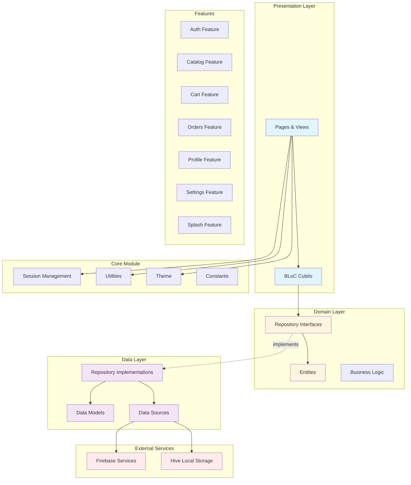
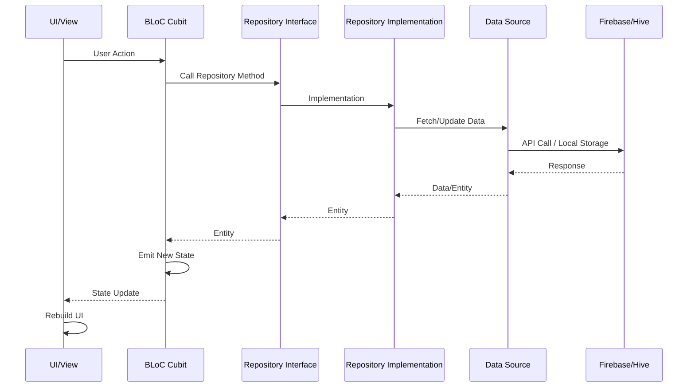

# 🧠🛍️ Smart Catalog

A Flutter mobile application for browsing digital product catalogs, adding items to a shopping cart, and placing orders. Users can view catalog pages, select products, manage their cart, track order history, and update their profile. Admins can manage catalogs and products through Firebase.

---

## 🚀 Features

- Splash screen and onboarding
- User authentication with Firebase
- Product listing and detail views
- Shopping cart and order placement
- Admin interface for managing catalogs and products

---

## 🛠️ Tech Stack

| Layer            | Technology                       |
|------------------|----------------------------------|
| UI               | Flutter                          |
| Architecture     | Clean Architecture + BLoC        |
| Navigation       | GoRouter                         |
| Backend          | Firebase (Auth, Firestore, Storage) |

---

## 📁 Project Structure

```bash
SmartCatalog/
├─ lib/
│  ├─ app/
│  │  └─ routes/          # App routing configuration
│  ├─ core/
│  │  ├─ constants/       # App constants (Firestore, Hive, assets)
│  │  ├─ data/            # Core data models & repositories
│  │  │  ├─ models/      # Data models (JSON serializable)
│  │  │  ├─ repositories/ # Repository implementations
│  │  │  └─ source/      # Data sources (Firebase Storage)
│  │  ├─ domain/          # Core domain entities & repositories
│  │  │  ├─ entities/    # Domain entities
│  │  │  └─ repositories/ # Repository interfaces
│  │  ├─ enums/           # Enumerations
│  │  ├─ errors/          # Error handling
│  │  ├─ session/        # Session management (User, Cart, Catalog, Orders)
│  │  ├─ theme/           # App theme configuration
│  │  ├─ utils/           # Utility functions
│  │  └─ widgets/         # Reusable widgets
│  ├─ extensions/         # Dart extensions
│  ├─ features/           # Feature modules (Clean Architecture)
│  │  ├─ auth/            # Authentication feature
│  │  │  ├─ data/         # Auth repository implementation
│  │  │  ├─ domain/       # Auth repository interface
│  │  │  └─ presentation/ # Auth UI (pages, cubits, widgets)
│  │  ├─ cart/            # Shopping cart feature
│  │  │  ├─ data/         # Cart repository implementation
│  │  │  ├─ domain/       # Cart repository interface
│  │  │  └─ presentation/ # Cart UI & view models
│  │  ├─ catalog/         # Catalog browsing feature
│  │  │  ├─ data/         # Catalog repository & models
│  │  │  ├─ domain/       # Catalog entities & repository
│  │  │  └─ presentation/ # Catalog UI
│  │  ├─ order_detail/    # Order detail view feature
│  │  │  └─ presentation/ # Order detail UI & widgets
│  │  ├─ orders/           # Orders list feature
│  │  │  └─ presentation/ # Orders UI
│  │  ├─ profile/         # User profile feature
│  │  │  ├─ data/         # Profile repository implementation
│  │  │  ├─ domain/       # Profile repository interface
│  │  │  └─ presentation/ # Profile UI & view models
│  │  ├─ reset_password/  # Password reset feature
│  │  │  └─ presentation/ # Reset password UI
│  │  ├─ settings/        # App settings feature
│  │  │  ├─ data/         # Settings repository implementation
│  │  │  ├─ domain/       # Settings repository interface
│  │  │  └─ presentation/ # Settings UI & widgets
│  │  ├─ splash/          # Splash screen feature
│  │  │  ├─ data/         # Splash repository implementation
│  │  │  ├─ domain/       # Splash repository interface
│  │  │  └─ presentation/ # Splash UI
│  │  └─ tabbar/           # Bottom navigation feature
│  │     └─ presentation/ # Tabbar UI
│  └─ main.dart           # App entry point
├─ assets/                # App assets (images, animations, translations)
└─ test/                  # Test files
```

---

## 🏗️ Architecture

The project follows **Clean Architecture** with **BLoC (Cubit)** pattern for state management. The architecture is organized in independent layers that facilitate maintenance, testing, and scalability.

### Architecture Diagram



### Data Flow



### Architecture Layers

#### 🎨 **Presentation Layer**
- **Responsibility**: User interface and state management
- **Components**:
  - `Pages`: Application screens
  - `Views`: Presentation widgets
  - `Cubits`: State management with BLoC pattern
  - `Models`: ViewModels for UI

#### 🧠 **Domain Layer**
- **Responsibility**: Pure business logic (framework-independent)
- **Components**:
  - `Entities`: Domain objects
  - `Repository Interfaces`: Data access contracts
  - `Use Cases`: Business logic (implicit in repositories)

#### 💾 **Data Layer**
- **Responsibility**: Data access implementation
- **Components**:
  - `Repository Implementations`: Repository implementations
  - `Data Models`: Data models (JSON serialization)
  - `Data Sources`: Data sources (Firebase, Hive)

#### 🔧 **Core Module**
- **Responsibility**: Shared functionality
- **Components**:
  - `Session Management`: User, cart, and catalog session management
  - `Utils`: Utilities (navigation, validators, formatters)
  - `Theme`: Theme configuration
  - `Constants`: Application constants
  - `Widgets`: Reusable widgets

### External Dependencies

- **Firebase**: Authentication, database (Firestore), and storage
- **Hive**: Local storage for cart, orders, and configuration
- **GetIt**: Dependency injection
- **GoRouter**: Declarative navigation
- **Easy Localization**: Internationalization (i18n)


### Home Screen


### Login Screen


### Loading


## Add to Shopping Cart

