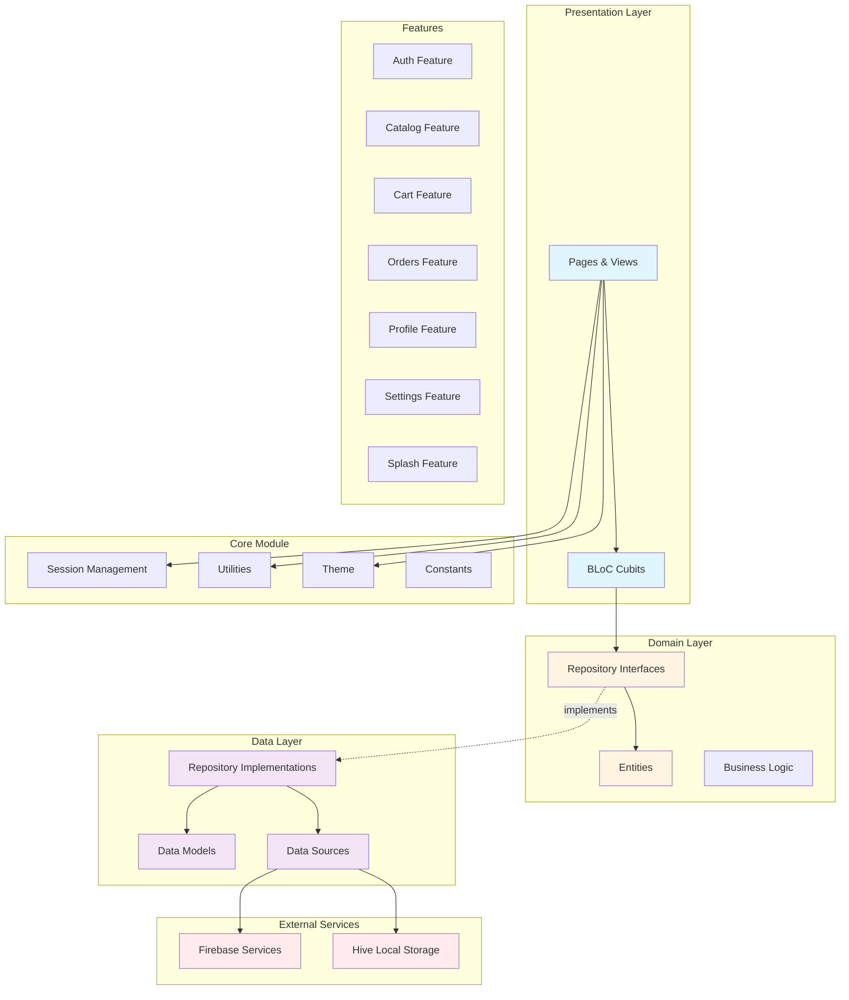
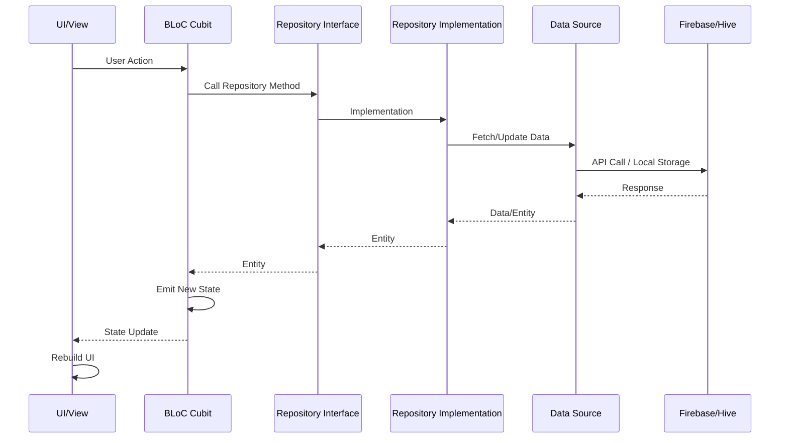
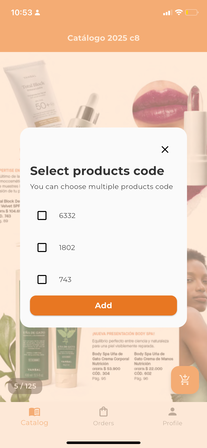

# 🧠🛍️ Smart Catalog

**Smart Catalog** Smart Catalog is a mobile application that turns printed magazine pages into interactive shopping catalogs. It allows users to browse, view, and order products directly from scanned magazine content. The app is designed to facilitate product sales through catalogs, making it easier and more efficient to showcase products and place orders.

---

## 🚀 Features

- Splash screen and onboarding
- User authentication with Firebase
- Product listing and detail views
- Shopping cart and order placement
- Admin interface for managing catalogs and products

---

## 🛠️ Tech Stack

| Layer            | Technology                       |
|------------------|----------------------------------|
| UI               | Flutter                          |
| Architecture     | Clean Architecture + BLoC        |
| Navigation       | GoRouter                         |
| Backend          | Firebase (Auth, Firestore, Storage) |

---

## 📁 Project Structure

```bash
SmartCatalog/
├─ lib/
│  ├─ app/
│  │  └─ routes/
│  ├─ core/
│  │  ├─ constants/
│  │  ├─ theme/
│  │  ├─ utils/
│  │  └─ widgets/
│  ├─ extensions/
│  ├─ features/
│  │  ├─ auth/
│  │  │  ├─ data/
│  │  │  ├─ domain/
│  │  │  └─ presentation/
│  │  ├─ catalog/
│  │  │  ├─ data/
│  │  │  ├─ domain/
│  │  │  └─ presentation/
│  │  ├─ splash/
│  │  └─ tabbar/
│  └─ main.dart
```

---

## 🏗️ Architecture

El proyecto sigue **Clean Architecture** con el patrón **BLoC (Cubit)** para la gestión de estado. La arquitectura está organizada en capas independientes que facilitan el mantenimiento, testing y escalabilidad.

### Diagrama de Arquitectura



### Flujo de Datos



### Capas de la Arquitectura

#### 🎨 **Presentation Layer**
- **Responsabilidad**: Interfaz de usuario y gestión de estado
- **Componentes**:
  - `Pages`: Pantallas de la aplicación
  - `Views`: Widgets de presentación
  - `Cubits`: Gestión de estado con BLoC pattern
  - `Models`: ViewModels para la UI

#### 🧠 **Domain Layer**
- **Responsabilidad**: Lógica de negocio pura (independiente de frameworks)
- **Componentes**:
  - `Entities`: Objetos de dominio
  - `Repository Interfaces`: Contratos para acceso a datos
  - `Use Cases`: Lógica de negocio (implícita en los repositorios)

#### 💾 **Data Layer**
- **Responsabilidad**: Implementación de acceso a datos
- **Componentes**:
  - `Repository Implementations`: Implementación de repositorios
  - `Data Models`: Modelos de datos (JSON serialization)
  - `Data Sources`: Fuentes de datos (Firebase, Hive)

#### 🔧 **Core Module**
- **Responsabilidad**: Funcionalidades compartidas
- **Componentes**:
  - `Session Management`: Gestión de sesiones de usuario, carrito, catálogo
  - `Utils`: Utilidades (navegación, validadores, formatters)
  - `Theme`: Configuración de temas
  - `Constants`: Constantes de la aplicación
  - `Widgets`: Widgets reutilizables

### Dependencias Externas

- **Firebase**: Autenticación, base de datos (Firestore) y almacenamiento
- **Hive**: Almacenamiento local para carrito, órdenes y configuración
- **GetIt**: Inyección de dependencias
- **GoRouter**: Navegación declarativa
- **Easy Localization**: Internacionalización (i18n)


### Home Screen


### Login Screen


### Loading


## Add to Shopping Cart

